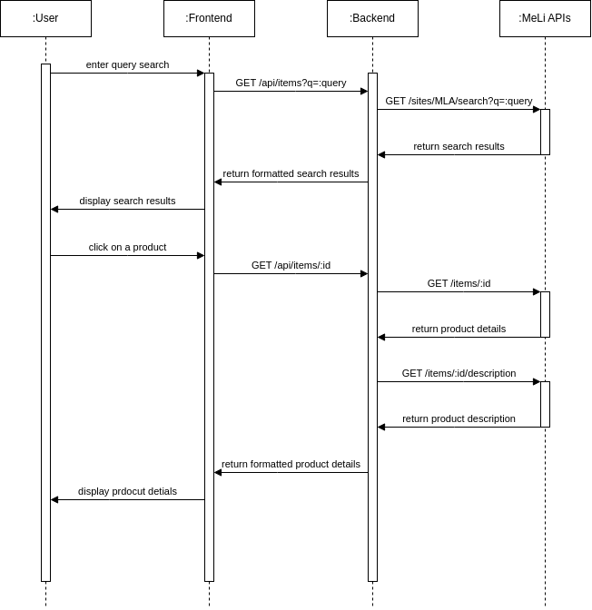
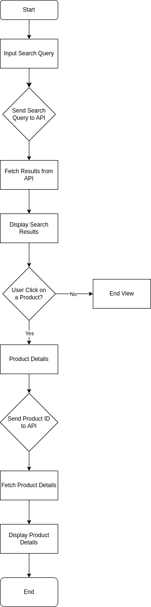

# ml-search-app

## How to run this project
### Client
- Use git clone on the repository, it will create a ml-search-app directory./n
- Open 2 terminals. Use one to cd into the client/ directory.
- Create a file called `.env.local` on the root of the client/ and add the following lines to it and save:
  - `NEXT_PUBLIC_ITEMS_URL='/api/items?q='`
  - `NEXT_PUBLIC_SINGULAR_ITEM_URL='/api/items/'`
- Use the command `nvm use` to set the correct node version which is v20.9.0, if you do not have it installed you will need to install it to continue.
- Still in the root directory execute `npm install`
- After it finishes installing you may use `npx next build` to build the project and then `npm start` to execute it. Or you could also `npm run dev`.
- There are tests included in the client/ directory, you may execute them by using the command `npm test`.

### Server
- That is all for the client, now go to the second terminar and cd into the server/ directory.
- In the root of the directory create a file name `.env` and add this two lines to it:
   - `API_BASE_URL=https://api.mercadolibre.com`
   - `ITEMS_SEARCH_PATH=/sites/MLA/search?q=`
- Use the command `nvm use` to set the correct node version which is v20.9.0, if you do not have it installed you will need to install it to continue.
- Now still on the root of the server/ directory run `npm install`
- Similar to the client there are tests on the serverside as well, you may execute them with `npm test`
- To execute the server simply run `npm start` or `npm run dev`

After both porjects are running simultaneously, you can go to [localhost:3000](http://localhost:3000) and try it for yourself.

## Diagrams
### Sequence Diagram
This diagram illustrates the sequence of interactions between the user, frontend, backend, and external APIs.

### Flowchart
This flowchart provides an overview of the application's workflow and how data flows through different components.

## License
This project is licensed under the MIT License.
